# Wix-windows-installer-xml-toolset ( .msi 安裝工具 )
`此專案中的檔案僅為部分檔案內容，實際以新建Wix專案為主`

---
##  Wix 環境建置

### **Step 1. 安裝 Visual Studio 2022 版本** 
該專案需在 Visual Studio 2022 版本下開啟。

### **Step 2. 安裝 Wix v4 套件**
開啟上方工具列 延伸模組 > 管理延伸模組，瀏覽分頁搜尋 HeatWave 並安裝，關閉 Visual Studio 後將開始安裝。
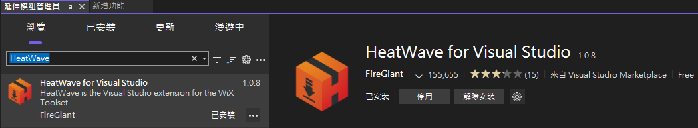

---
## Wix 頁面設計

於 Package.wxs 設定 UI 介面的設計參考。
```
	<Package ... >
		...
		<UIRef Id="InstallAgentUIDialog" />
		...
	</Package>
```

因整體流程及頁面皆為自訂設計，需調整頁面顯示的條件。
```
	<Package ... >
		...
		<UIRef Id="InstallAgentUIDialog" />
		<InstallUISequence>
			<Show Dialog="Agent_Welcome_Dlg" Before="ExecuteAction" />
			<Show Dialog="Install_Agent_Dlg" After="Agent_Welcome_Dlg" Condition="NOT Installed"/>
			<Show Dialog="Uninstalling_Agent_Dlg" After="Agent_Welcome_Dlg" Condition="Installed"/>
			<Show Dialog="Operation_Completed_Dlg" OnExit="success" />
			<Show Dialog="Operation_Interrupted_Dlg" OnExit="cancel" />
			<Show Dialog="Operation_Error_Dlg" OnExit="error" />
		</InstallUISequence>
		<AdminUISequence>
			<Show Dialog="Operation_Completed_Dlg" OnExit="success" />
			<Show Dialog="Operation_Interrupted_Dlg" OnExit="cancel" />
			<Show Dialog="Operation_Error_Dlg" OnExit="error" />
		</AdminUISequence>
		...
	</Package>
```

於 InstallAgentUIDialog.wxs 設計 UI 內容
1. Welcome Page
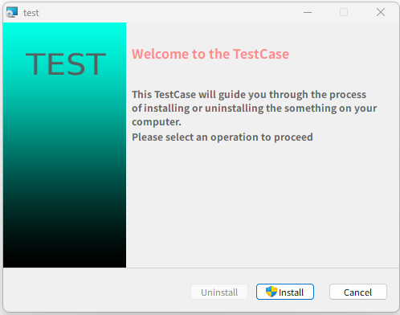

2. License Agreement Page
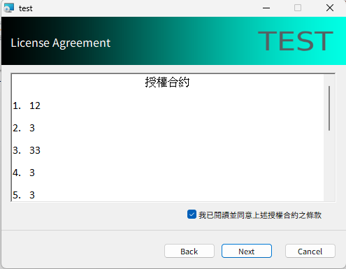	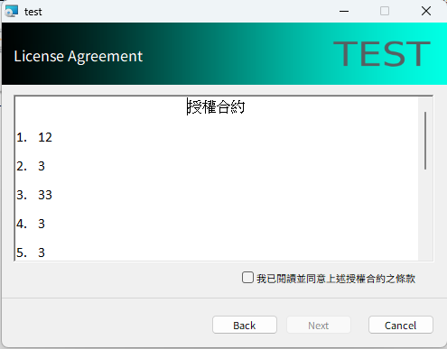

3. Client Configuration Page
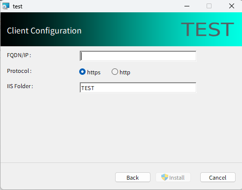	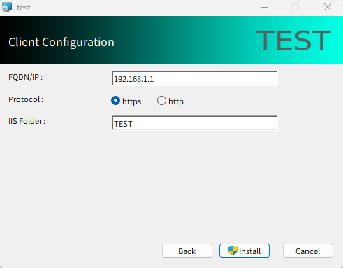

4. Install Agent Page
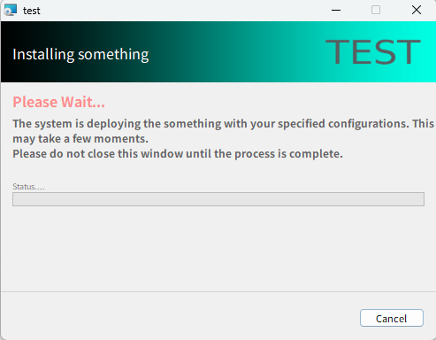

5. Uninstall Agent Page
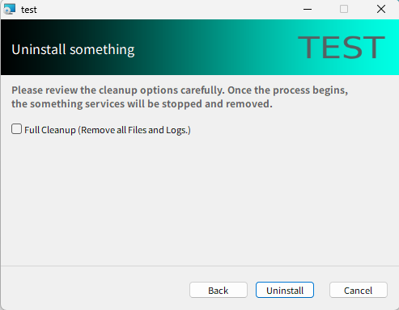

6. Uninstalling Agent Page
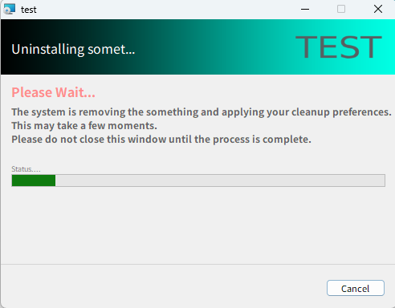

7. Operation Completed Page
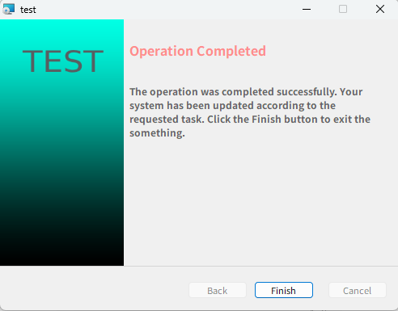

8. Operation Interrupted Page
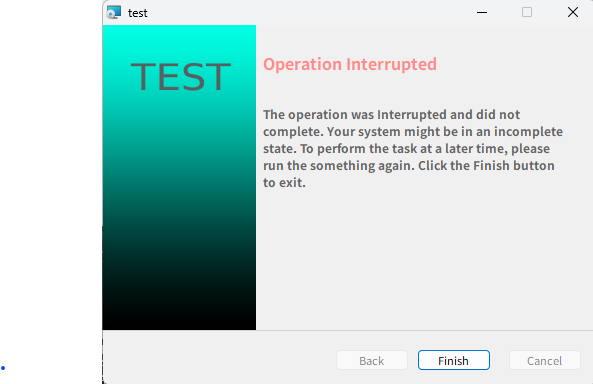

9. Operation Error Page
與 Operation Interrupted Page 同頁面，皆為執行中斷。

---
## Wix 執行邏輯設計

於 Package.wxs 設定執行邏輯的參考。
```
	<Package ... >
		...
		<Feature Id="Main">
			<ComponentGroupRef Id="[ComponentGroup Id-1]" />
			<ComponentGroupRef Id="[ComponentGroup Id-2]" />
			<ComponentGroupRef Id="[ComponentGroup Id-3]" />
      ...
		</Feature>
	</Package>
```

於 Components.wxs 設計執行邏輯流程。
1. 檔案複製
2. 產生ini檔案
3. 安裝服務
4. 刪除資料夾邏輯

---
## 額外補充

### 檢查系統已安裝套件
可透過 Windows 登陸檔 ( Registry ) 的機碼確認是否已安裝軟體或套件等，並設定啟用條件。
```
	<Package ... >
		<!-- 偵測本機是否已安裝 VC++(x86)，將結果存入指定的變數 -->
		<Property Id="VC_X86_INSTALLED">
			<RegistrySearch Id="CheckVCX86"
							Root="HKLM"
							Key="SOFTWARE\Microsoft\VisualStudio\14.0\VC\Runtimes\X86"
							Name="Installed"
							Type="raw"
							Bitness="always32"/>
		</Property>
		<!-- 設定安裝啟動條件，「Installed」代表如果是解除安裝或修復，「VC_X86_INSTALLED = "#1"」代表當該登錄檔數值為 1 時，才允許繼續安裝 -->
		<Launch  Condition="VC_X86_INSTALLED = &quot;#1&quot; OR Installed"  Message="安裝失敗！本軟體需要 Visual C++ Redistributable (x86) 執行環境。請先前往微軟官網下載並安裝該套件後，再重新執行本安裝程式。"/>		
		...
	</Package>
```

### Wix 變數應用
```
宣告全域變數時，Id需全大寫， Value 不可為空，當變數沒有值時，Condition 可使用 Condition="NOT [變數名稱]"，當變數有值則使用 Condition="[變數名稱]=&quot;0&quot;"。
可於 <Fragment> 設定 <Property> 標籤的變數，若頁面設計控制項有設定該變數名稱，該控制項的預設內容為變數內容。
```
```
<Fragment>
	<Property Id="PROTOCOL" Value="https"></Property>
	<Property Id="IISFOLDERNAME" Value="test"></Property>
	<Property Id="FIREWALLPORT" Value="80,443"></Property>
	...
</Fragment>
```

*專案變數設定*
可在專案建置檔 ( .wixproj ) 中設定變數
```
<Project Sdk="WixToolset.Sdk/5.0.2">
  <PropertyGroup>
    <DefineConstants>
			Dir=$(SolutionDir)\test;
			ProductName=test;
			Manufacturer=myself;
			Version=1.0.0;
		</DefineConstants>
    <Cultures>zh-TW</Cultures>
  </PropertyGroup>
  <ItemGroup>
    <PackageReference Include="WixToolset.Firewall.wixext" Version="5.0.2" />
    <PackageReference Include="WixToolset.Heat" Version="5.0.2" />
    <PackageReference Include="WixToolset.UI.wixext" Version="5.0.2" />
    <PackageReference Include="WixToolset.Util.wixext" Version="5.0.2" />
  </ItemGroup>
</Project>
```
Package.wxs 中的應用
```
<Package Name="$(var.ProductName)" Manufacturer="$(var.Manufacturer)" Version="$(var.Version)" UpgradeCode="..." ProductCode="*" >
...
</Package>
```

### Debug 方法
WiX (Windows Installer XML Toolset) 的設計是基於 XML 架構的，因此無支援逐行偵錯功能，僅能整體設計完後編譯建置.msi檔案執行檢查。

---
## 專案限制

### Wix 設計限制
- .msi 不能執行另一個 .msi 限制
Windows Installer 服務本身禁止同時間進行多個交易或巢狀安裝，以避免系統登錄檔與檔案鎖定衝突。

- 標題欄的小圖示與檔案圖示不能調整
MSI 執行時顯示的預設外觀、標題欄圖示及檔案總管中的副檔名圖示，是由作業系統的 msiexec.exe 統一管理，無法直接置換該視窗的圖示。

以上限制皆可透過 Bootstrapper ( Bundle ) 方式解決，產出的檔案為 .exe 檔案。
